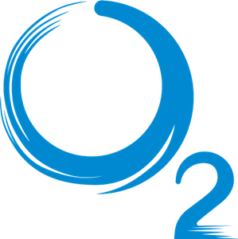
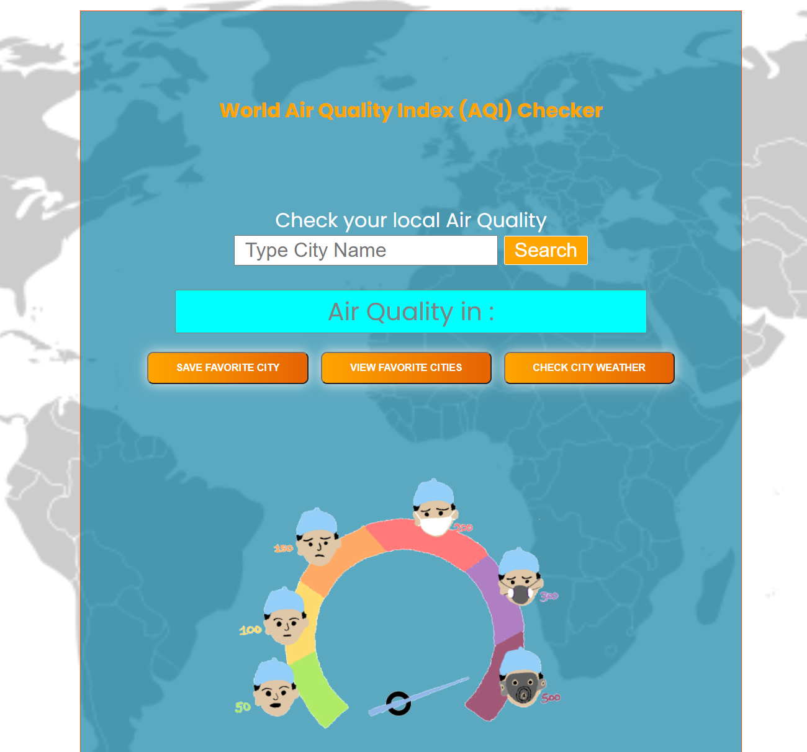

#  - Quality

## O2-Quality app was built with 'React.js'

O2-Quality is a web app that was built with 'React.js'. This app uses API's for "Air Quality Index" (AQI) and weather. This app allows you to pull pollution data from API, see the pollution in any city, save favorite cities, and check weather details in any city.

### Check out the app [here](https://o2-quality.netlify.app)

### Created by: [Dragan](https://github.com/DraganCicic), [Josh](https://github.com/jbaker825), and [Seth](https://github.com/sarebro77)

## The API used was for "Air Quality Index" (AQI)

- Think of the AQI as a yardstick that runs from 0 to 500.
- The higher the AQI value, the greater the level of air pollution and the greater the health concern.
- For example, an AQI value of 50 or below represents good air quality, while an AQI value over 300 represents hazardous air quality.

## What you can do with the app

- Pull pollution info from API
- Be able to see the pollution in any city at any time
- Save favorite cities
- Check weather details in a city

